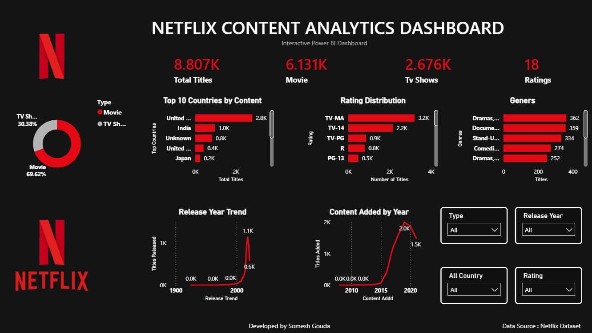

# 🎬 Netflix Content Analytics Dashboard

An interactive **Power BI Dashboard** built using the Netflix Movies & TV Shows dataset to analyze content trends, genres, ratings, countries, and release patterns through dynamic visualizations and interactive filters.

---

## 📸 Dashboard Preview



---

## 📖 Project Overview

This dashboard provides insights into Netflix's content library using interactive charts, KPIs, and slicers. It helps users explore trends across movies and TV shows, understand genre popularity, rating distribution, release patterns, and country-wise content availability.

---

## ✨ Key Features

- 📊 Total Titles KPI
- 🎥 Movies vs TV Shows Distribution
- 🌍 Top 10 Countries by Content
- ⭐ Rating Distribution Analysis
- 🎭 Genre-wise Content Analysis
- 📅 Release Year Trend
- 📈 Content Added by Year
- 🎛 Interactive Slicers
  - Type
  - Country
  - Rating
  - Release Year

---

## 🛠 Tech Stack

- Microsoft Power BI Desktop
- Power Query
- DAX (Data Analysis Expressions)
- Microsoft Excel
- Python (Jupyter Notebook)

---

## 📂 Repository Structure

```
Netflix-Content-Dashboard/
│
├── Netflix_Dashboard.pbix
├── Netflix_Dashboard.png
├── netflix_analysis.ipynb
├── netflix_cleaned.csv
├── netflix_titles.csv
├── Requirements.txt
└── README.md
```

---

## 📌 Dataset

- Netflix Movies and TV Shows Dataset (Kaggle)

---

## 📈 Dashboard Insights

- Movies account for approximately **70%** of the content.
- TV Shows contribute around **30%** of the library.
- Most Netflix content was added after **2016**.
- Drama and International genres dominate the platform.
- TV-MA is the most common content rating.
- The United States has the highest number of titles.

---

## 🚀 Getting Started

1. Clone this repository.
2. Open **Netflix_Dashboard.pbix** using Power BI Desktop.
3. Explore the dashboard using the interactive slicers.

---

## 📷 Project Screenshot


---

## 👨‍💻 Author

**Somesh Gouda**

🔗 LinkedIn  
https://www.linkedin.com/in/somesh-gouda-1020a432b/

💻 GitHub  
https://github.com/SomeshGouda

---

## ⭐ Support

If you found this project useful, consider giving this repository a ⭐ on GitHub.
